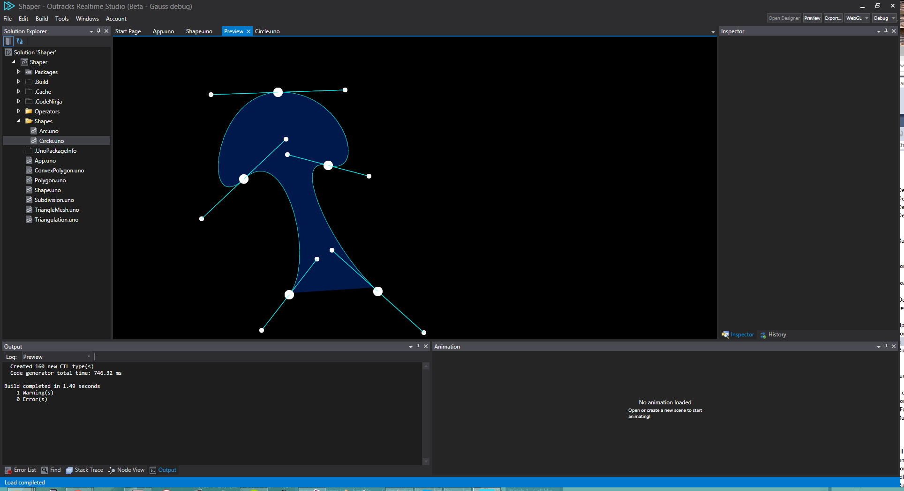

Shaper
======

2D/3D shape processing library for Uno



Buzzwords
---------

- Use logic operators to create complex 2D shapes out of primitives (or arbitrary bezier curves)
- Fill any shape with color, texture, or even a totally custom shader
- Animate shapes with a functional reactive approach
- A nomadic API makes programming a breeze, while still maintaining an immutable object graph
- Constructing shapes using the Node editor will also be possible (when providing constructor arguments in ux files is supported)

Example
-------


```csharp
var circle = new Circle(Radius: 50);
var animatedInnerCircle = circle.Animate(Position: t => float2(0, t.Tan(_time)*100));
var outline = circle.Outline(Radius: 5);

var color = float4(1, 0.2f, 0, 1);

_fullShape = outline.Union(circle.Intersect(animatedInnerCircle));

// maybe even:
//_fullShape = (outline + circle ^ animatedInnerCircle);

...
_fullShape.Draw(brush);
```

```csharp
var circle = new Circle().Animate(Position : t => t.EaseOut(float2(0,0), float2(0,200)));

_shape = circle;
for (int i = 1; i < 10; i++)
	shape += circle
		.Translate(float2(i*50,0))
		.Delay(0.1*i);

...
_shape.Draw(brush);
```

Maybe later, extruding shapes to create 3D solids:
```csharp
var meshA = _myShape.Extrude(10.0f);
var meshB = _myShape.Revolve(float2(1,0), float2(0,0));

_mesh = meshA.Subtract(meshB);
...
_mesh.Draw(material);
```

Status
-------

What we have:
- Polygonization of bezier splines
- Triangulation of simple polygons without holes

What we need asap:
- A polygon editor (for debugging purposes)
- Remove holes from polygons
- Handle loops in curves/polygons
- Boolean operators 
  - Note: I think these should operate on bezier splines before polygonizing
  - Note2: The same code could probably work for solving the loops?

What we want:
- Shrink/Expand/Outline
- Animation support
  - Atm the plan is to inject evaluation functions in the object graph, which will take precedence over static values. A conveniency `.Animate(...)` method will make this easy and readable. I think we should pass time as a parameter to these `Func`'s, so we can easily do stuff such as `.Delay()`-ing shapes etc (which is important when creating juicy motion graphics!)

What we want a bit later:
- Constructing shapes from text
- Extruding and revolving shapes into 3D solids
- A similar 3D CSG library to do similar things with the 3D solids :)

Licence
-------

Something free, BSD?
